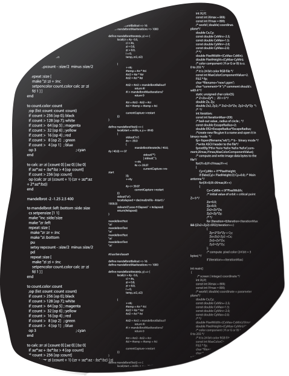

# rosettacode-to-go

  

Rosette Code Go Sources

What we have done:  
1. Download from https://github.com/acmeism/RosettaCodeData   
2. Added sloc  
3. Append File & Folder to the go-files  
4. go fmt -s -w . (952 > 356 # 998)
